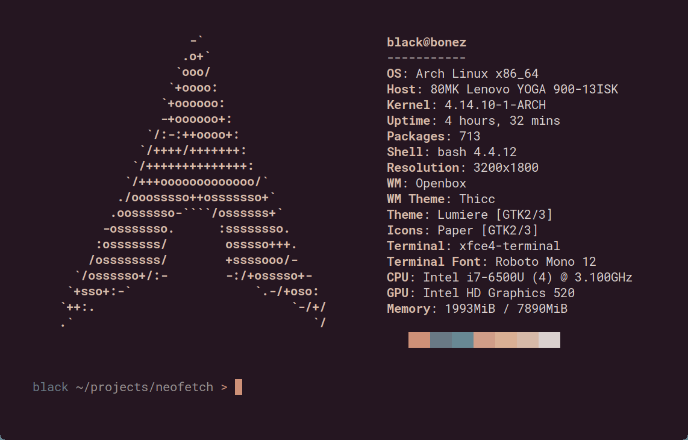

# Guía de Configuración: Oh My Posh (WSL / Ubuntu)

Esta guía te ayudará a configurar **Oh My Posh** en tu subsistema Linux (WSL/Ubuntu) con el tema **Atomic**.

---

## 0. Requisitos Previos

*   **WSL instalado** (Ubuntu preferiblemente).
*   **Windows Terminal** como emulador de terminal.
*   **Permisos de `sudo`** para instalar paquetes.

---

## 1. Instalación de Oh My Posh

Abre tu terminal de Ubuntu y ejecuta el siguiente comando para instalar Oh My Posh:

```bash
curl -s https://ohmyposh.dev/install.sh | bash -s
```

**Verificación:** Reinicia la terminal 
```bash
source ~/.bashrc
```
y ejecuta:
```bash
oh-my-posh --version
```

---

## 2. Configuración de Fuentes (Nerd Fonts)

Al igual que en Windows, necesitamos una **Nerd Font** instalada en **Windows** (no en Linux) para que Windows Terminal pueda mostrar los iconos.

1.  **Si ya instalaste Hack Nerd Font en Windows**, ya estás listo
2.  **Si no**, descárgala e instálala en Windows: [Hack Nerd Font (v3.4.0)](https://github.com/ryanoasis/nerd-fonts/releases/download/v3.4.0/Hack.zip).

### Configurar Windows Terminal
Asegúrate de que tu perfil de **Ubuntu** en Windows Terminal use la fuente.
En `Settings (JSON)`, busca tu perfil de Ubuntu (o en `defaults`) y verifica:

```json
"font": {
    "face": "Hack Nerd Font Mono"
}
```

---

## 3. Configuración del Tema y Perfil

### Descargar el Tema (Atomic)
Creamos una carpeta oculta en tu usuario de Linux y descargamos el tema:

```bash
# Crear directorio
mkdir ~/.posh-themes

# Descargar el tema
wget https://raw.githubusercontent.com/JanDeDobbeleer/oh-my-posh/main/themes/atomic.omp.json -O ~/.posh-themes/atomic.omp.json
```

### Instalar Iconos de Terminal (LSD)
Para tener iconos en el comando `ls`, usaremos `lsd` (LSDeluxe), una alternativa moderna.

1.  Descarga e instala el paquete `.deb` (para arquitectura x86_64/amd64):
    ```bash
    # Descargar ultima versión (v1.0.0) y instalar
    wget https://github.com/lsd-rs/lsd/releases/download/v1.0.0/lsd_1.0.0_amd64.deb
    sudo dpkg -i lsd_1.0.0_amd64.deb
    rm lsd_1.0.0_amd64.deb # Limpiar archivo
    ```

---

## 4. Configurar el Archivo .bashrc

Haremos que Oh My Posh y los iconos (`lsd`) carguen al inicio.

1.  Abre tu archivo de configuración con `nano`:
    ```bash
    nano ~/.bashrc
    ```

2.  **Ve al final del archivo** y pega el siguiente bloque:

    ```bash
    # --- Configuración de Oh My Posh y Alias ---

    # 1. Iniciar Oh My Posh
    export PATH=$PATH:~/.local/bin
    eval "$(oh-my-posh init bash --config ~/.posh-themes/atomic.omp.json)"

    # 2. Alias para usar lsd con iconos en lugar de ls (Opcional)
    alias ls='lsd'
    alias l='lsd -l'
    alias la='lsd -a'
    alias lla='lsd -la'
    alias lt='lsd --tree'
    ```

3.  **Guarda y Sal**: Presiona `Ctrl + O` -> `Enter` (para guardar) y luego `Ctrl + X` (para salir).

---

## 5. Finalizar

Recarga tu configuración actual para ver los cambios inmediatamente:

```bash
source ~/.bashrc
```

---

# Opcional
## Configurar Neofetch

Neofetch muestra información del sistema en la terminal de una manera estética (similar a winfetch en Windows).



### 1. Instalación
Actualiza tus repositorios e instala Neofetch:

```bash
sudo apt update
sudo apt install neofetch -y
```

### 2. Configuración en .bashrc
Para que Neofetch se ejecute automáticamente al abrir la terminal:

1. Abre tu `.bashrc`:
    ```bash
    nano ~/.bashrc
    ```

2. Agrega la siguiente línea al final del archivo:

    ```bash
    # --- Configuración de Neofetch ---
    neofetch
    ```

3. Guarda (`Ctrl + O`, `Enter`) y sal (`Ctrl + X`).

### 3. Aplicar cambios
Recarga tu configuración:
```bash
source ~/.bashrc
```

¡Listo! Tu terminal debería verse increíble ahora.